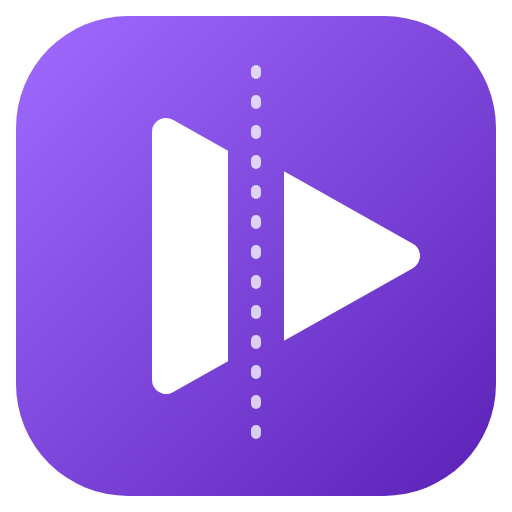

<p align="center">
  
</p>

<h1 align="center">VideoCutter</h1>

<p align="center">
  Télécharge <b>seulement le passage qui t'intéresse</b> d'une vidéo en ligne,<br>
  en vidéo ou en musique, sans passer par un logiciel de montage.
</p>

---

## Ce que fait VideoCutter

1. Tu colles le lien d'une vidéo (YouTube, X, Instagram, TikTok, Dailymotion, Reddit, SoundCloud… plus de 1000 sites).
2. Tu choisis le début et la fin de l'extrait, avec un aperçu de la vidéo.
3. Tu choisis le format, et seul ce morceau est téléchargé.

**Formats** — Vidéo : MP4, MKV, WEBM, MOV, AVI, **GIF** · Musique : MP3, WAV, FLAC, M4A, OGG, OPUS
**Qualité** — « Auto » prend la meilleure qualité disponible ; le menu ne propose que les qualités qui existent pour la vidéo.

**Découpe** — aperçu, miniatures du début et de la fin, zoom sur la barre de découpe, chapitres, liens avec un temps (`?t=`), plusieurs extraits d'un coup (fichiers séparés ou recollés), « enlever ce passage », raccourcis clavier (`I`, `O`, `Espace`, flèches…).
**Export** — cadrage 9:16, 1:1 ou 4:5 (rogné ou sur fond flou), vitesse (×0,5 à ×2), fondu, volume harmonisé, boomerang, texte et logo incrustés, sous-titres (fichier `.srt` ou incrustés), vidéo sans le son, qualité audio au choix, taille maximale (10, 25 ou 50 Mo), taille estimée avant le téléchargement, nom de fichier modifiable et nettoyé (emojis, #, @).
**Images** — capture PNG de l'image affichée, miniature de la vidéo.
**Confort** — file d'attente (et playlists entières), historique, lien du presse-papiers proposé automatiquement, glisser-déposer d'un lien, glisser le fichier terminé directement dans un autre logiciel, choix mémorisés, notification et progression dans la barre des tâches, mise à jour automatique avec « Quoi de neuf ? », connexion aux sites pour les vidéos réservées aux membres, interface en français ou en anglais.

## Installation (Windows 10 / 11)

1. Télécharge `VideoCutter-Setup-x.y.z.exe` dans la page **[Releases](../../releases)**.
2. Lance-le. Windows peut afficher « Windows a protégé votre ordinateur » car l'installateur n'est pas signé :
   clique sur **Informations complémentaires**, puis **Exécuter quand même**.
3. Pour mettre à jour, lance simplement l'installateur de la nouvelle version : l'ancienne est remplacée, tes réglages sont conservés.

## 🔒 Confidentialité et sécurité

- **Aucun serveur** : VideoCutter n'envoie rien à personne. Pas de compte, pas de statistiques, pas de publicité, pas de pistage.
- L'appli ne communique qu'avec **le site de la vidéo** que tu télécharges, et avec **GitHub** pour vérifier ses mises à jour (celles de l'appli et de yt-dlp). Une mise à jour n'est téléchargée qu'après ton accord.
- Le presse-papiers n'est lu que lorsque la fenêtre de l'appli reprend la main, et seulement pour y repérer un lien web ; rien d'autre n'en est lu ni conservé.
- L'historique des téléchargements est enregistré uniquement sur ton PC et peut être effacé à tout moment.
- **Connexions aux sites** : elles se font dans une fenêtre de l'appli séparée de ton navigateur. Elles restent **sur ton PC**, chiffrées par Windows, et ne sont utilisées que si un site l'exige. Tes mots de passe sont tapés sur la page officielle du site ; l'appli ne les enregistre pas.
- La fenêtre de l'appli n'a aucun accès direct au système ; tous les liens, temps et formats sont vérifiés avant d'être transmis aux outils de téléchargement.
- Les outils inclus (yt-dlp, FFmpeg) sont vérifiés par empreinte SHA-256 lors de la fabrication de l'installateur et à chaque mise à jour.

## Compiler soi-même

Prérequis : [Node.js](https://nodejs.org) 20 ou plus récent, Windows.

```bash
npm install          # dépendances (Electron, electron-builder)
npm run binaries     # télécharge et vérifie yt-dlp et FFmpeg dans vendor/
npm start            # lance l'appli en mode développement
npm run dist         # fabrique l'installateur dans dist/
```

`npm run icon` régénère l'icône à partir du dessin contenu dans `build/render-icon.js`.

## Utilisation responsable

Ne télécharge que des contenus que tu as le droit de télécharger, et respecte les conditions d'utilisation des sites.
Au premier lancement, VideoCutter affiche ses conditions d'utilisation, qui doivent être acceptées : chaque utilisateur est seul responsable de ce qu'il télécharge.
VideoCutter n'est affilié à aucun des sites pris en charge ; leurs noms sont cités uniquement pour indiquer la compatibilité.

## Licence

VideoCutter est un logiciel libre, distribué sous licence **GNU GPL v3 ou ultérieure** — voir [`LICENSE`](LICENSE).
Il est fourni sans aucune garantie.

Il s'appuie sur [yt-dlp](https://github.com/yt-dlp/yt-dlp), [FFmpeg](https://ffmpeg.org) et [Electron](https://www.electronjs.org) :
voir [`THIRD_PARTY_NOTICES.md`](THIRD_PARTY_NOTICES.md) pour leurs licences et l'accès à leur code source.
